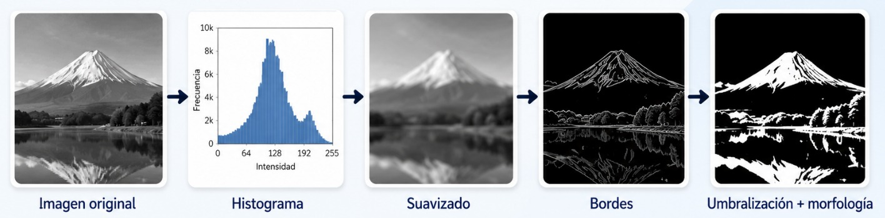

<div align="center">

<h1>Procesamiento Digital de Imágenes</h1>

<p>
Repositorio educativo para aprender <strong>procesamiento y filtrado digital de imágenes</strong> desde un nivel introductorio.
</p>

<p>
  
  
  
</p>

</div>

El recorrido combina explicaciones intuitivas, implementaciones paso a paso y comparaciones con herramientas de uso común como **NumPy** y **OpenCV**. La intención no es únicamente aprender a utilizar funciones, sino comprender qué ocurre con los píxeles, cómo funciona cada técnica y en qué situaciones puede ser útil.

<p align="center">
  
</p>

## ¿A quién está dirigido?

Este repositorio está pensado para estudiantes y personas que desean comenzar a trabajar con imágenes digitales utilizando Python.

No se requiere experiencia previa en procesamiento digital de imágenes. Sin embargo, se recomienda conocer fundamentos básicos de Python, por ejemplo:

- variables y tipos de datos;
- condicionales;
- ciclos;
- funciones;
- listas;
- importación de módulos.

Los conceptos específicos de imágenes, matrices, histogramas, filtros y segmentación se introducen progresivamente a lo largo de los notebooks.

## 🎯 Objetivo

Desarrollar una comprensión introductoria del procesamiento digital de imágenes mediante Python, combinando fundamentos conceptuales, implementaciones paso a paso y herramientas como NumPy y OpenCV.

### Al finalizar el recorrido podrás

- comprender cómo una imagen digital se representa y almacena como una matriz;
- interpretar conceptos fundamentales como píxel, intensidad, `shape`, `dtype` y canales de color;
- manipular regiones de una imagen mediante índices, recortes y *slicing*;
- analizar la distribución de intensidades mediante histogramas;
- aplicar transformaciones de intensidad y comprender su efecto sobre la imagen;
- mejorar el contraste mediante ecualización de histograma y CLAHE;
- comprender el funcionamiento de la convolución, los kernels y el tratamiento de bordes mediante *padding*;
- reconocer distintos tipos de ruido y comparar filtros de suavizado para reducirlos;
- identificar cambios de intensidad y detectar bordes mediante Sobel, Laplaciano y Canny;
- segmentar imágenes mediante técnicas de umbralización;
- procesar y limpiar imágenes binarias mediante operaciones morfológicas;
- seleccionar técnicas básicas de procesamiento de imágenes de acuerdo con el problema y analizar sus resultados.

## 🧭 Ruta de aprendizaje

Se recomienda seguir los módulos en orden, ya que algunos conceptos se reutilizan posteriormente.

| Módulo | Tema | Notebook |
| :---: | --- | --- |
| 01 | Imágenes como matrices | [`01_imagenes_como_matrices.ipynb`](notebooks/01_imagenes_como_matrices.ipynb) |
| 02 | Operaciones básicas y *slicing* | [`02_operaciones_basicas.ipynb`](notebooks/02_operaciones_basicas.ipynb) |
| 03 | Histogramas y transformaciones de intensidad | [`03_histogramas_y_transformaciones.ipynb`](notebooks/03_histogramas_y_transformaciones.ipynb) |
| 04 | Ecualización de histograma | [`04_ecualizacion_histograma.ipynb`](notebooks/04_ecualizacion_histograma.ipynb) |
| 05 | CLAHE | [`05_clahe.ipynb`](notebooks/05_clahe.ipynb) |
| 06 | Ruido y filtros de suavizado | [`06_filtros_suavizado.ipynb`](notebooks/06_filtros_suavizado.ipynb) |
| 07 | Detección de bordes | [`07_deteccion_bordes.ipynb`](notebooks/07_deteccion_bordes.ipynb) |
| 08 | Umbralización | [`08_umbralizacion.ipynb`](notebooks/08_umbralizacion.ipynb) |
| 09 | Operaciones morfológicas | [`09_operaciones_morfologicas.ipynb`](notebooks/09_operaciones_morfologicas.ipynb) |

## ¿Cómo utilizar este repositorio?

El recorrido combina aprendizaje guiado, práctica e interpretación.

| Etapa | Qué hacer | Propósito |
| --- | --- | --- |
| **1. Estudia el notebook** | Revisa las explicaciones, ejemplos e implementaciones paso a paso del módulo. | Comprender, visualizar y comparar los conceptos. |
| **2. Realiza el ejercicio** | Resuelve la actividad correspondiente en `exercises/`. | Practicar la implementación, aplicación y análisis. |
| **3. Consulta la solución** | Revisa `solucion.ipynb` después de intentar el ejercicio. | Comparar tu propuesta con una solución explicada y reproducible. |

## 🚀 Instalación y ejecución

El proyecto puede utilizarse en **JupyterLab**, **VS Code** o **Google Colab**.

### JupyterLab con Conda

Si todavía no tienes un entorno para el proyecto, desde la carpeta raíz ejecuta:

```bash
conda env create -f environment.yml
conda activate filtrado-digital
pip install -e .
jupyter lab
```

Una vez abierto JupyterLab, entra a `notebooks/` y comienza con:

```text
01_imagenes_como_matrices.ipynb
```

Si ya tienes un entorno Conda creado, puedes utilizarlo:

```bash
conda activate NOMBRE_DE_TU_ENTORNO
conda install -c conda-forge jupyterlab ipykernel pytest pip
pip install -e .
jupyter lab
```

> `pip install -e .` instala el proyecto en modo editable, permitiendo importar las funciones de `src/filtrado_digital/` desde los notebooks.

### VS Code con Conda

Activa el entorno Conda e instala el proyecto:

```bash
conda activate filtrado-digital
pip install -e .
```

Después abre la carpeta completa del repositorio en VS Code:

```bash
code .
```

Para trabajar con los notebooks `.ipynb` se recomienda tener instaladas las extensiones **Python** y **Jupyter**.

Selecciona como kernel el mismo entorno Conda donde instalaste el proyecto.

### Google Colab

En Google Colab no necesitas crear un entorno Conda local.

Puedes clonar el repositorio e instalarlo directamente en la sesión:

```python
!git clone https://github.com/LarizaCovarrubias/filtrado-digital-imagenes.git
%cd filtrado-digital-imagenes
!pip install -e .
```

Después de la instalación, los mismos imports utilizados en JupyterLab y VS Code estarán disponibles en Colab.

## 📁 Estructura del repositorio

```text
filtrado-digital-imagenes/
├── notebooks/             # Lecciones principales
├── exercises/             # Ejercicios y soluciones
├── src/
│   └── filtrado_digital/  # Funciones reutilizables
├── images/                # Imágenes y licencias
├── tests/                 # Pruebas automáticas
├── environment.yml        # Entorno Conda
├── pyproject.toml         # Configuración del proyecto
├── .gitignore
├── LICENSE
└── README.md
```

## 🖼️ Imágenes

El repositorio incluye una fotografía real y algunas imágenes sintéticas utilizadas en los ejemplos.

La procedencia y las condiciones de uso de estos recursos están documentadas en [`images/README.md`](images/README.md).

También puedes utilizar tus propias imágenes para experimentar con las técnicas presentadas.

## Licencia

El código y el material educativo del repositorio se distribuyen bajo licencia MIT.

Las imágenes de terceros conservan sus propias condiciones de uso. La información correspondiente está documentada en [`images/README.md`](images/README.md).
